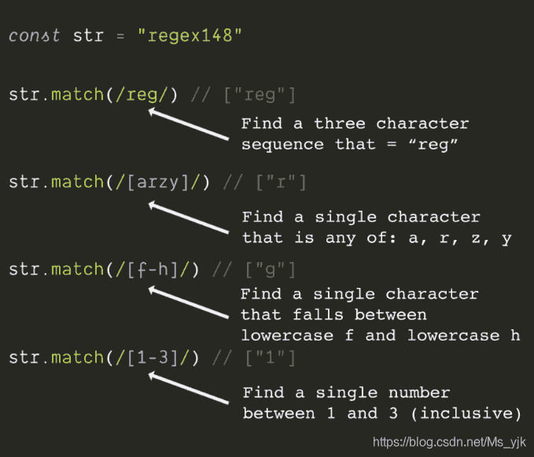

<!--yml
category: codewars
date: 2022-08-13 11:45:19
-->

# 在Codewars刷题时常用的正则表达式_End_less__的博客-CSDN博客

> 来源：[https://blog.csdn.net/Ms_yjk/article/details/102653521?ops_request_misc=&request_id=&biz_id=102&utm_term=codewars&utm_medium=distribute.pc_search_result.none-task-blog-2~all~sobaiduweb~default-3-102653521.nonecase](https://blog.csdn.net/Ms_yjk/article/details/102653521?ops_request_misc=&request_id=&biz_id=102&utm_term=codewars&utm_medium=distribute.pc_search_result.none-task-blog-2~all~sobaiduweb~default-3-102653521.nonecase)

原文链接：[http://caibaojian.com/10-regex-tip.html](http://caibaojian.com/10-regex-tip.html)

## 1.匹配模式

正则表达式查找与模式匹配的字符串部分[·](http://caibaojian.com/10-regex-tip.html)

在[JavaScript](http://caibaojian.com/t/javascript)中，它们是在正斜杠之间//或使用new RegExp()

然后用于match ， test或replace

您可以预先定义正则表达式，也可以直接在调用方法时定义

## 2.匹配多个

一次匹配单个字符，

或将多个字符放在方括号[]中以捕获任何匹配的字符

使用连字号捕获一系列字符-

## 3.可选标志

在正则表达式的末尾添加可选标志，以修改匹配器的工作方式。

在JavaScript中，这些标志是：

i =不区分大小写 m =多行匹配 g =全局匹配（查找全部，而不是查找一个）

## 4.开始和结束

在开始处使用插入符号^表示“字符串开始”

在末尾使用美元符号$表示“字符串结尾”

开始将匹配项组合在一起以匹配更长的字符串

## 5.通配符

使用通配符和特殊的转义字符来匹配较大类的字符

。 =除换行符外的任何字符

\ d =数字 \ D =不是数字

\ s =空格 \ S =任何非空白

\ n新行

## 6.特定数量

仅将特定数量的匹配字符或组与量词匹配

=零或更多 =还有一个？ = 0或1 {3} =正好3倍{2，4} =两倍，三倍或四倍{2，} =两倍或更多倍

## 7.小括号匹配组

使用parens（）捕获组

match会返回完整匹配加上组，除非您使用g标志

使用管道运算符| 在parens（）内部以指定该组匹配的内容

| =或

## 8.反斜杠

要匹配特殊字符，请使用反斜杠\

[JS](http://caibaojian.com/javascript/)正则表达式中的特殊字符是：^ $ \。 * +？ （）[] {} |

因此，要匹配一个星号，可以使用：

\ *

不只是*

## 9.中括号里的^

要匹配某个字符但要匹配某个字符，请在方括号内使用插入号^

这意味着^有两个含义，可能会造成混淆。

当它在正则表达式的前面时，它表示“字符串的开始”，而在方括号内使用时，则表示“不是此字符”。

