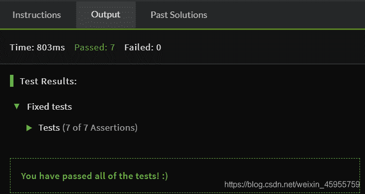

<!--yml
category: codewars
date: 2022-08-13 11:38:39
-->

# 新手学python，在codewars上的第一条代码_慈祥的清辉的博客-CSDN博客

> 来源：[https://blog.csdn.net/weixin_45955759/article/details/107691746?ops_request_misc=%257B%2522request%255Fid%2522%253A%2522166036058916781685355945%2522%252C%2522scm%2522%253A%252220140713.130102334.pc%255Fall.%2522%257D&request_id=166036058916781685355945&biz_id=0&utm_medium=distribute.pc_search_result.none-task-blog-2~all~first_rank_ecpm_v1~rank_v31_ecpm-3-107691746-null-null.142^v40^control,185^v2^control&utm_term=codewars](https://blog.csdn.net/weixin_45955759/article/details/107691746?ops_request_misc=%257B%2522request%255Fid%2522%253A%2522166036058916781685355945%2522%252C%2522scm%2522%253A%252220140713.130102334.pc%255Fall.%2522%257D&request_id=166036058916781685355945&biz_id=0&utm_medium=distribute.pc_search_result.none-task-blog-2~all~first_rank_ecpm_v1~rank_v31_ecpm-3-107691746-null-null.142^v40^control,185^v2^control&utm_term=codewars)

新手学python，在codewars上的第一条代码

最近学习需要，python用的比较多，所以看了不少的资料，但是还是要自己去动手敲一敲代码才能够更加熟练。
刚开始是接触到的第一个题目是喝水的问题：
Nathan骑车一小时要喝掉0.5升的水，写一个函数计算Nathan喝水量，数值向下取整，刚开始用round，发现不太对，最后查了一下，应该是用math.floor进行向下取整。
输出显示

具体的代码是这样的：

```
import math
def litres(time):
    a = 0.5
    return math.floor(time * a) 
```