<!--yml
category: codewars
date: 2022-08-13 11:45:06
-->

# 有了这15款编程游戏，谁都可以学编程！_Eric_HYD的博客-CSDN博客

> 来源：[https://blog.csdn.net/haha223545/article/details/98601543?ops_request_misc=&request_id=&biz_id=102&utm_term=codewars&utm_medium=distribute.pc_search_result.none-task-blog-2~all~sobaiduweb~default-5-98601543.nonecase](https://blog.csdn.net/haha223545/article/details/98601543?ops_request_misc=&request_id=&biz_id=102&utm_term=codewars&utm_medium=distribute.pc_search_result.none-task-blog-2~all~sobaiduweb~default-5-98601543.nonecase)

**1、Coding Games**

一边玩游戏，一边挑战编程难题。Coding games支持包括PHP、C、JavaScript在内的20多种编程语言。用户界面功能强大，可以定制。

例如，你可以选择你的代码编辑器的风格： Emacs、Vim、Classic。

如果你想提升编程技能，玩Coding games是一种有趣的途径。

网址：www.codingame.com

**2、CodeCombat（极客战记）**

CodeCombat 是一款网页编程游戏。这款编程游戏借鉴了游戏的很多设计元素，游戏剧情十分丰富。

当你打开CodeCombat网站，你不会觉得这是一个让你看不懂的代码学习网站，因为他的网站外观看起来就像是一个魔兽争霸风格的线上游戏，而且当你实际玩玩看，你会发现过程真的就是英雄要去打怪、寻宝与解谜，只是搭配了程序语言的学习。

CodeCombat能够学习 Python、JavaScript、Lua、CoffeeScript、Clojure 等不同程序语言，这些语言能够运用到游戏设计、网页应用、App 的开发上。

CodeCombat网址：cn.codecombat.com

极客战记（中国版CodeCombat）网址：codecombat.163.com

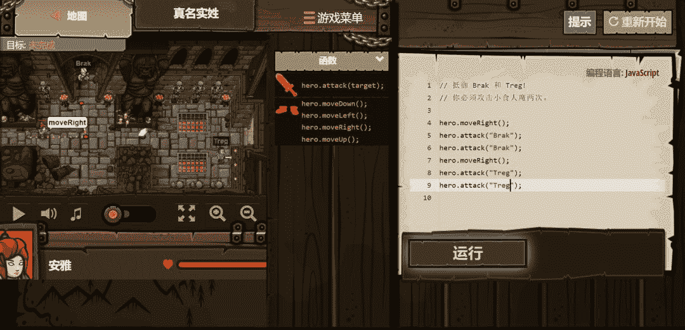

**3、Screeps**

如果你想学习JavaScript，那Screeps是一个很好的选择，Screeps 是一个为 JavaScript 程序员准备的大型多人在线游戏(MMO)。

这个游戏是一个开放的策略游戏，游戏中你控制的单位被称为“creeps”，它可以帮你获得资源、建立自己的领地等等。作为一个多人在线游戏，游戏中你的creeps会被其他玩家的creeps包围。

网址：screeps.com

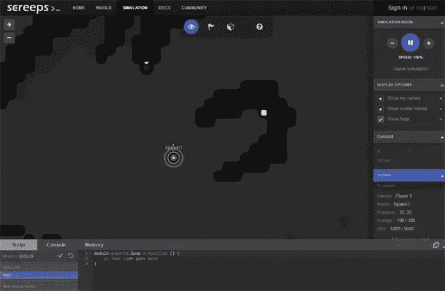

**4、Checkio**

Check iO 是一个基于浏览器的游戏，你需要使用 Python 或 JavaScript 来解决问题才能将游戏进行下去（需要登录）。

网址：checkio.org

**5、Vim Adventures**

顾名思义，这个网站让你通过玩游戏来学习 Vim。

网址：vim-adventures.com

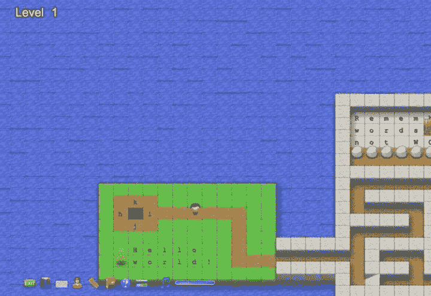

**6、Cyber Dojo**

Cyber-dojo是一个提供给程序员们练习写程序的地方。支持 JavaScript、Java、Python、PHP、Ruby 等语言。

网址：www.cyber-dojo.org/

源代码：

https://github.com/JonJagger/cyber-dojo

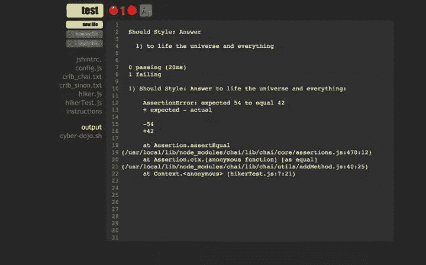

**7、Code Monkey**

CodeMonkey 是一款非常富有童趣的网页编程游戏，玩家通过编程向怪兽小猴子传达指令，帮助小猴子吃到香蕉就可以过关了。 

CodeMonkey 以游戏闯关的方式进行教学，总共有300多个关卡，涉及到编程的各种概念。

网址：www.playcodemonkey.com

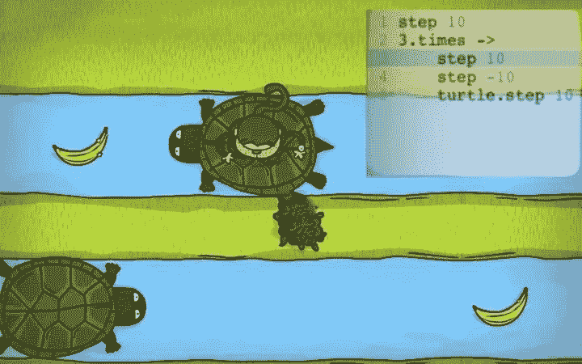

**8、Elevator Saga**

电梯编程游戏，需要一步步解决问题过关。比如说第一关是在 60 秒内运输 15 个人。（编程语言为JavaScript）

网址：play.elevatorsaga.com/

代码：

https://github.com/magwo/elevatorsaga

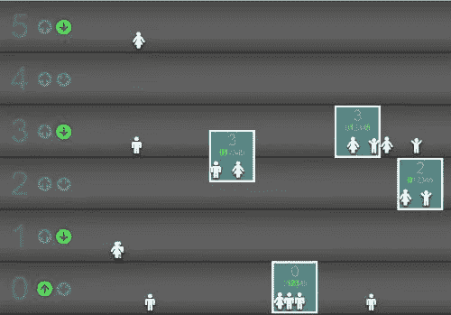

**9、Codewars**

在战斗中进行学习。和其他人一起在真实的编程挑战中提升技巧，支持JavaScript、Python、C#、Java、Python等语言（支持的语言见下图）。

网址：www.codewars.com

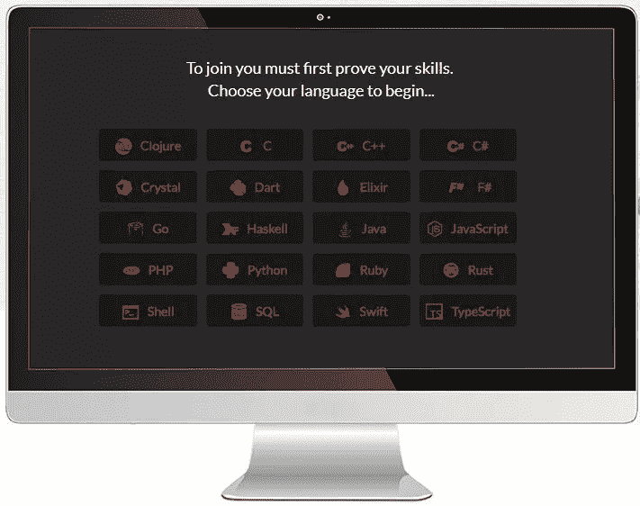

**10、Ruby Quiz**

Ruby Quiz是一个面向Ruby程序员的每周编程挑战项目，目前有156个测验项目。

网址：rubyquiz.com/

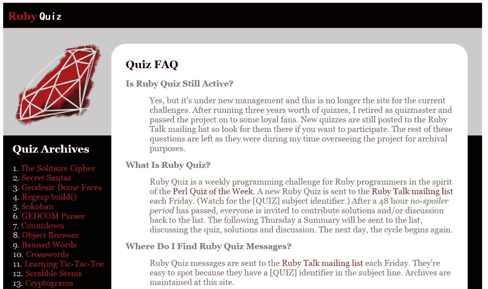

**11、Git-Game**

Git-game是一个基于终端的游戏，它用来教授 git 中的那些非常酷的功能。游戏的主题内容是搜寻，通过 git 命令来找到线索，解开谜题。

网址：www.git-game.com

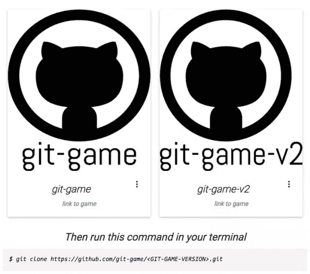

**12、Hacker.org**

hacker.org 挑战赛是一系列的拼图、敲砖块、测试和智力题，用来测试你的黑客能力。要通过这一系列的考验，你需要学会解密、编码、渗透等等技能，揭开重重迷雾。

网址：www.hacker.org/

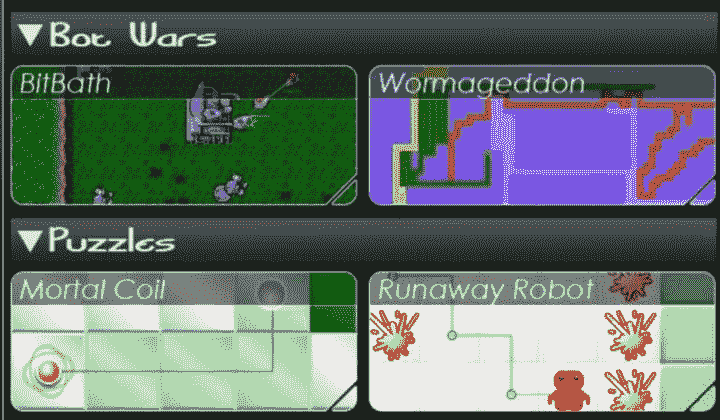

**13、Code Hunt**

Code Hunt 是一个由Microsoft Research开发的 HTML5 科幻主题游戏。在这个游戏中，你扮演一个代码猎人，负责修复代码，并使它它返回预期的结果。Code Hunt支持 Java 和 C# 两种语言。你可以学习到包括算法、循环和条件表达式等编程概念。

网址：www.codehunt.com

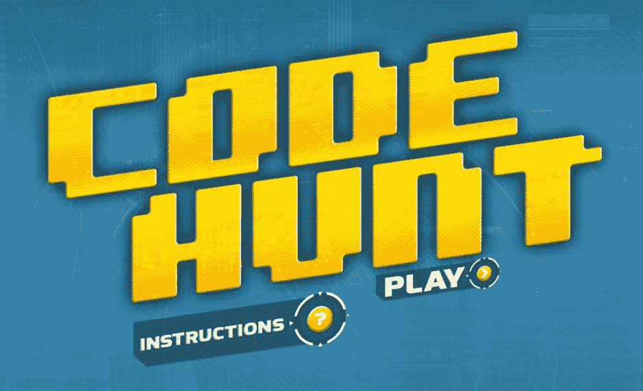

**14、Fight Code**

在 FightCode 中，通过编写 JavaScript 代码，你可以创建一个能够击败其他玩家机器人的机器人。

网址：http://fightcode.io

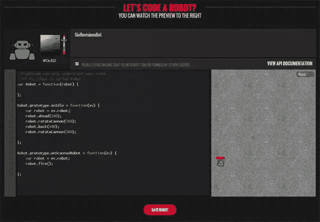

**15、Human Resource Machine**

Human Resource Machine 是一款非常有意思的移动端游戏。这款游戏由粘粘世界（World of Goo）的设计者和制作小小炼狱（Little Inferno）的团队共同制作，游戏虽是走解谜路线，但玩法相当新颖：玩家将扮演一个从基层做起的员工，需要通过指令代码来编写一条条程序，完成每个阶段的任务，最终走上职场巅峰。

主人公需要将邮件按照要求进行分发。游戏注重计算机硬件实现方面的技术。在游戏中非常形象的表现出了内存，寄存器，输入输出等概念，以及如何利用这些硬件来实现基本的运算、排序等功能。

这款游戏界面十分有意思，画风清奇，任务具有较大的挑战性，适合有一定编程基础或者年龄稍大的孩子玩。

网址：tomorrowcorporation.com

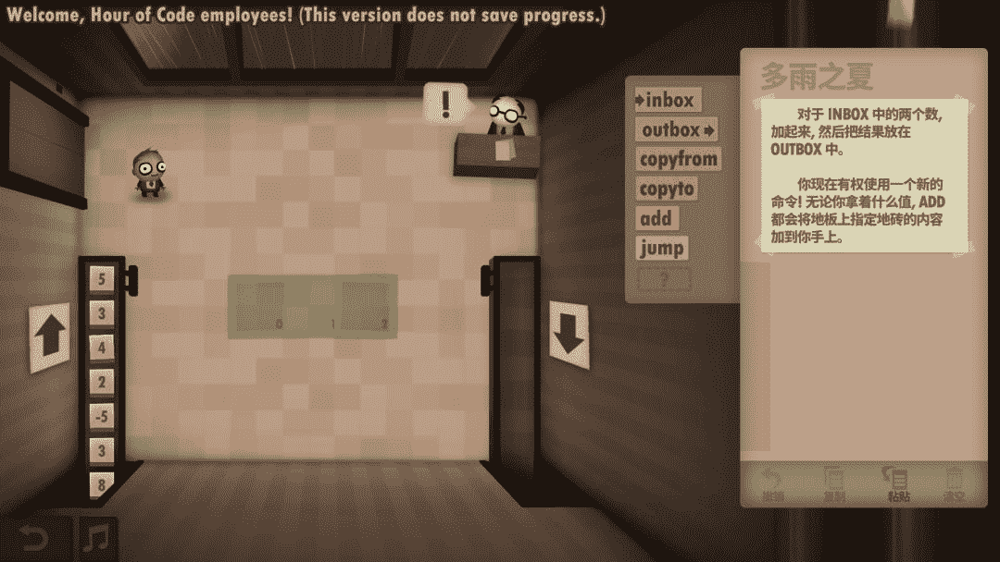

**16、其他类似的编程游戏网站**

CodeChef ：在这里你可以解决实际问题、参加不同的比赛，这些比赛每月都会进行。

Pex for fun ：这是微软开发的一个游戏，在这个游戏中你需要和其他的程序员进行比拼。而代码就是你的武器。

Rankk ：你需要解决一系列由易到难的问题。这个游戏是对 Pyramid 游戏的复刻，Pyramid里面有很多逻辑和数学问题。

TopCoder ：在这个游戏里你不光可以解决问题，还可以获取真金白银。来自全世界知名IT公司的程序员在这里互相挑战，为的就是赢得他们的奖品。

Google Code Jam ：Google 大赛上已经解决的算法问题。在这里你可以自己试一试。

Python Challenge：玩家可以通过 Python 编程解决问题并提升等级。

Lumosity ：一组能够训练大脑的游戏，由科学家和游戏设计师一同开发。

Algorithm Geeks ：一个交流讨论算法的 Google 群组。

CodeKata ：妙趣横生的编程问题。

LessThanDot ：一个专门论坛，程序员在这里发布一些比较困难的编程挑战。

The Daily WTF ：类似BYOD(Bring Your Own Device)模式，不过这里是BYOD(Bring Your Own Code)程序员们编写他们自己的代码片段放在这里，用来解决一些比较困难的问题。

Peking University JudgeOnline for ACIP/ICPC ：这里包含了不同比赛中涉及到的不同的问题。你可以实时的解决问题并且查看结果，你的答案也会被验证是否正确。

University of Valladolid Online Judge ：与北京大学OJ平台类似，但是包含了不同的问题。

Programming Praxis：这个博客每周都会出一些新的编程问题。

Project Euler ：包含了很多复杂的数学问题，这让发烧友们感到非常开心。

4Clojure ：在这里你可以通过解决一些不同难易程度的问题来学习 Clojure 。

Prolog Problems ：你可以在这里练习逻辑编程。

Codingbat ：由很多 Java 和 Python 的习题（难度各有不同）。

Sphere Online Judge ：各种各样的编程问题。

Rosalind ：通过解决实际问题来学习算法和生物信息学。

LeetCode ：这个网站是为了帮助程序员准备面试而创建的。在这里你可以找到不同领域的典型问题。

Career Cup ：程序员面试时最容易被问到的真实问题。

Kodable：Kodable是一款适用于 5 岁及以上儿童的教育型 iPad 游戏，适合为儿童进行编程启蒙。

Lightbot ：Lightbot是一款移动端游戏，玩家通过控制机器人的移动在固定位置点亮灯泡。

Box Island：Box Island 是一款经典且屡获殊荣的移动端编程冒险游戏，这款游戏在为孩子们带来令人兴奋的冒险体验的同时， 向他们介绍编程的基础知识。 

Tips：看了小编总结的这么多游戏，赶快运行一个游戏体验一下编程的乐趣吧！

来源：辰语程序员学习笔记

版权归原作者所有，转载仅供学习使用，不用于任何商业用途，如有侵权请留言联系删除，感谢合作。