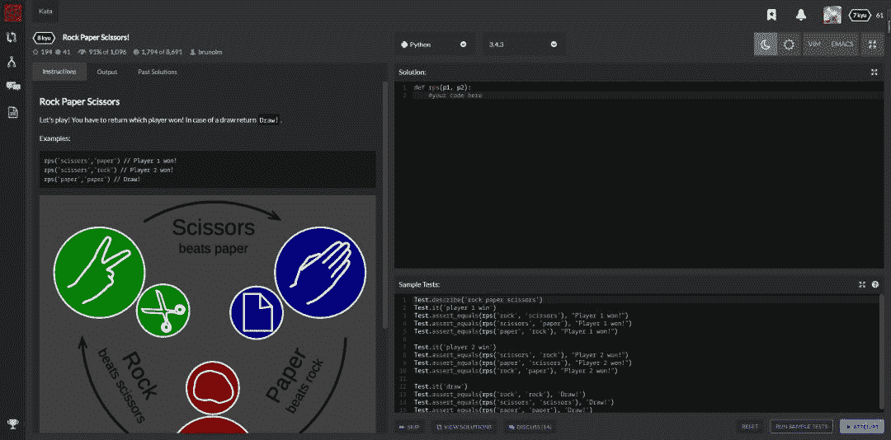

<!--yml
category: codewars
date: 2022-08-13 11:43:22
-->

# 来codewars与我一起玩耍吧_Python爬虫与算法进阶的博客-CSDN博客

> 来源：[https://blog.csdn.net/m0_37148637/article/details/103461297?ops_request_misc=&request_id=&biz_id=102&utm_term=codewars&utm_medium=distribute.pc_search_result.none-task-blog-2~all~sobaiduweb~default-4-103461297.nonecase](https://blog.csdn.net/m0_37148637/article/details/103461297?ops_request_misc=&request_id=&biz_id=102&utm_term=codewars&utm_medium=distribute.pc_search_result.none-task-blog-2~all~sobaiduweb~default-4-103461297.nonecase)

先看一道题目

如何使用代码表示“石头、剪刀、布”之间的关系。

> 即：石头 > 剪刀，剪刀 > 布， 剪刀 > 布

当时我想了很多，构造一个字典，和数字对应，但是应该如何表示“大小”关系呢？想破脑袋都想不出来，最后看了答案，形如

```
`dict = {'a': 'b', 'b': 'c', 'c': 'a'}` 
```

简直是妙啊！！！

原题在这里，Rock Paper Scissors!，可以自己试试看。

我觉得很妙的解法

CodeWars

这是CodeWars上的一题，我觉得挺有意思的。CodeWars其实和leetcode差不多，但是我更喜欢有这几点。

## 界面



看着挺舒服的，同时提供了测试代码。

## 够简单

真的，CodeWars上有些题目真的很简单，适合我这种新手，哈哈，比如：

```
`# Complete the solution so that it reverses the string value passed into it.
#
# solution('world') # returns 'dlrow'

def solution(string):
    return string[::-1]` 
```


还可以选择问题类型。

## 可以自己出题，还可以邀请队友

codewars 点一下，就可以成为我的盟友。 (可以阅读原文)


点一下，玩一年，装逼不花一分钱！

## 可以上榜

leaderboard


第二名竟然是国人唉，不知是哪位大佬。希望有更多中国人可以出现在上面。

# 后话

目前我也还是一个萌新，希望大佬能带带我。

我在Github上开了一个仓库，codewars_python 里面都是用 python的解题方法，但是现在还只有几题而已，希望大家可以一起来参与，多提pr。

```
`# -*- coding: utf-8 -*-

# ATM machines allow 4 or 6 digit PIN codes and PIN codes cannot contain anything but exactly 4 digits or exactly 6 digits.

# If the function is passed a valid PIN string, return true, else return false.

# eg:

# validate_pin("1234") == True
# validate_pin("12345") == False
# validate_pin("a234") == False

# My Solutiuon

def validate_pin(pin):
    #return true or false
    return pin.isdigit() if len(pin) == 4 or len(pin) == 6 else False

 # Wonderful Solutiuon

 def validate_pin(pin):
    return len(pin) in (4, 6) and pin.isdigit()` 
```