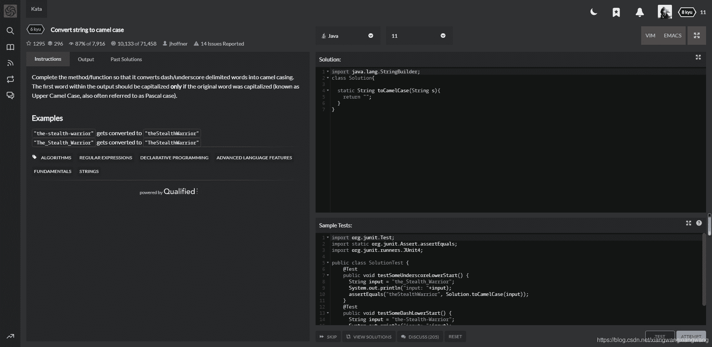
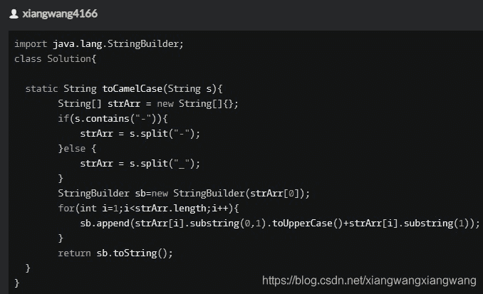
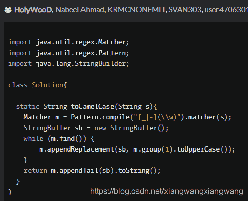
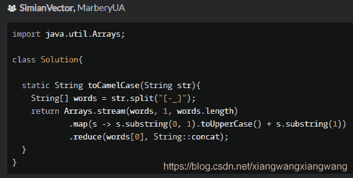

<!--yml
category: codewars
date: 2022-08-13 11:25:57
-->

# 编程刷题平台Codewars初体验-Java_禾女白儿厶的博客-CSDN博客_codewar

> 来源：[https://blog.csdn.net/xiangwangxiangwang/article/details/117849128?ops_request_misc=%257B%2522request%255Fid%2522%253A%2522166036032516782184646989%2522%252C%2522scm%2522%253A%252220140713.130102334..%2522%257D&request_id=166036032516782184646989&biz_id=0&utm_medium=distribute.pc_search_result.none-task-blog-2~all~sobaiduend~default-3-117849128-null-null.142^v40^control,185^v2^control&utm_term=codewars](https://blog.csdn.net/xiangwangxiangwang/article/details/117849128?ops_request_misc=%257B%2522request%255Fid%2522%253A%2522166036032516782184646989%2522%252C%2522scm%2522%253A%252220140713.130102334..%2522%257D&request_id=166036032516782184646989&biz_id=0&utm_medium=distribute.pc_search_result.none-task-blog-2~all~sobaiduend~default-3-117849128-null-null.142^v40^control,185^v2^control&utm_term=codewars)

点此欢迎光临我的个人网站[【一几文星球】](https://yijiwen.cn/)

最近发现了一个很多网友都在推荐的编程刷题平台Codewars，作为一个对啥都好奇（啥都学不深 ）的编程菜鸟，我二话不说直接开始注册体验。

网站一进，嘿，全英文，看不懂，怎么办？不急，祭出各在线翻译工具，大致意思明白了就行。

刚注册完，界面就提示选编程语言，基于广泛涉猎（但都是蜻蜓点水）的习惯，Java、JavaScript、Go、Python、PHP、R、Shell、PowerShell、SQL、R等唰唰的一通全勾选上，不会没关系，这不是就来学了嘛。

然后还有个编程水平的选项，我选了入门，其他还有初级、中级、高级的选项。

在进入刷题界面前还有段代码让检查bug，比较简单，就是有一行代码没有结束的分号,加上一提交就过了。

接下来就是真正的题目来了：（网上说有两种给题方式，一种是平台随机给题，一种是自己找题，这里是平台随机给题）

> 题目：
> 
> Complete the method/function so that it converts dash/underscore delimited words into camel casing. The first word within the output should be capitalized **only** if the original word was capitalized (known as Upper Camel Case, also often referred to as Pascal case).
> 
> 完成方法/函数，以便将破折号/下划线分隔的单词转换为驼峰式大小写。 仅当原始单词大写时，输出中的第一个单词才应大写（称为 Upper Camel Case，通常也称为 Pascal case）。[谷歌翻译]
> 
> ### Examples
> 
> `"the-stealth-warrior"` gets converted to `"theStealthWarrior"`
> `"The_Stealth_Warrior"` gets converted to `"TheStealthWarrior"`

而且调用的测试代码是已经给好了，要编写的就是类Solution里的toCamelCase方法。

由于平时写代码非常依赖编辑器的自动补全等功能，而Codewars是没有的，有点不习惯，所以是先在idea里面写了测试后再拿到Codewars提交的。

因为类Solution上面有个StringBuilder的引入，我以为是题目要求要用这个的，所以选择了用StringBuilder拼接字符串，但是后面提交后发现其他提交的很多都没有用到，想来应该不是题目条件而是一个提示罢了吧。

My Solutions（我的解决方案）：

提交通过后，可以看到很多网友大神的解决方案，然后我仔细研读了一些高赞的解决方案，越看越觉得自己真的菜，还有就是很多大神都用了正则表达式，代码是相当简洁，不像我罗里吧嗦，还很多方面没有考虑到。

该题的几个最佳实践：

高赞的第一个方案炸出来菜鸟我很多不知道的点啊，太多要学要看的了。
（正则表达式由于使用得不多，此前也都没怎么了解过regex这个工具包。）

高赞的第二个方案，使用了正则表达式和Lambda表达式，代码非常的简洁。 对比了下自己的代码，有点被打击到了。
（但是后面当我点开该题下的讨论，翻看了一下，怎么说呢，信心有找回一点点。）

最后，总结一下，Codewars是个很好的编程刷题平台，希望经常三分钟热度的自己能坚持刷下去。

点此欢迎光临我的个人网站[【一几文星球】](https://yijiwen.cn/)

下一篇：[Codewars编程刷题学习2（Java）Create Phone Number-有时候越简单的题越容易被人想得很难](https://blog.csdn.net/xiangwangxiangwang/article/details/117854255)

微信公众号，欢迎关注，一起学习。

