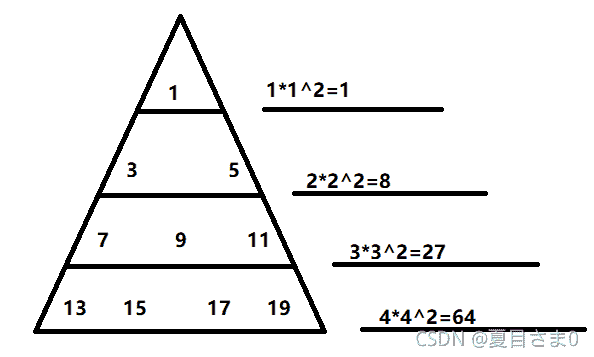
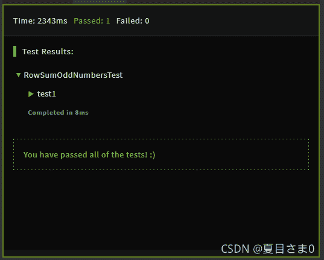

<!--yml
category: codewars
date: 2022-08-13 11:38:41
-->

# 编程游戏codewars(Sum of odd numbers-----Java)_AntPro的博客-CSDN博客

> 来源：[https://blog.csdn.net/qq_45858986/article/details/121168007?ops_request_misc=%257B%2522request%255Fid%2522%253A%2522166036058916781685355945%2522%252C%2522scm%2522%253A%252220140713.130102334.pc%255Fall.%2522%257D&request_id=166036058916781685355945&biz_id=0&utm_medium=distribute.pc_search_result.none-task-blog-2~all~first_rank_ecpm_v1~rank_v31_ecpm-4-121168007-null-null.142^v40^control,185^v2^control&utm_term=codewars](https://blog.csdn.net/qq_45858986/article/details/121168007?ops_request_misc=%257B%2522request%255Fid%2522%253A%2522166036058916781685355945%2522%252C%2522scm%2522%253A%252220140713.130102334.pc%255Fall.%2522%257D&request_id=166036058916781685355945&biz_id=0&utm_medium=distribute.pc_search_result.none-task-blog-2~all~first_rank_ecpm_v1~rank_v31_ecpm-4-121168007-null-null.142^v40^control,185^v2^control&utm_term=codewars)

## Sum of odd numbers（7kyu）

**Given the triangle of consecutive odd numbers:**
给定连续奇数的三角形：

```
 1
          3     5
       7     9    11
   13    15    17    19
21    23    25    27    29
... 
```

**Calculate the sum of the numbers in the nth row of this triangle (starting at index 1) e.g.: (Input --> Output)**
计算此三角形第n行中的数字之和（从索引1开始），例如：（输入–>输出）

```
1 -->  1
2 --> 3 + 5 = 8 
```

**solution:**

```
class RowSumOddNumbers {
    public static int rowSumOddNumbers(int n) {
      return 0;
    }
} 
```

**Sample Tests:**

```
import static org.junit.Assert.*;
import org.junit.Test;

public class RowSumOddNumbersTest {

    @Test
    public void test1() {
        assertEquals(1, RowSumOddNumbers.rowSumOddNumbers(1));
        assertEquals(74088, RowSumOddNumbers.rowSumOddNumbers(42));
    }
} 
```

解决方法：


```
class RowSumOddNumbers {
    public static int rowSumOddNumbers(int n) {
      int sum=0;
      for(int i=1;i<=n;i++){
        sum=i*(int)(Math.pow(i, 2));
      }
	return sum;
    }
} 
```

