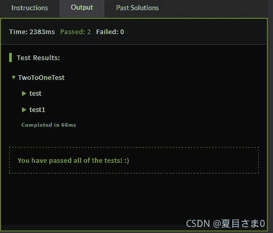

<!--yml
category: codewars
date: 2022-08-13 11:26:13
-->

# 编程游戏codewars(TwotoOne-----Java)_AntPro的博客-CSDN博客

> 来源：[https://blog.csdn.net/qq_45858986/article/details/121178149?ops_request_misc=&request_id=&biz_id=102&utm_term=codewars&utm_medium=distribute.pc_search_result.none-task-blog-2~all~sobaiduweb~default-5-121178149.142^v40^control,185^v2^control](https://blog.csdn.net/qq_45858986/article/details/121178149?ops_request_misc=&request_id=&biz_id=102&utm_term=codewars&utm_medium=distribute.pc_search_result.none-task-blog-2~all~sobaiduweb~default-5-121178149.142^v40^control,185^v2^control)

## TwotoOne（7kyu）

Take 2 strings s1 and s2 including only letters from ato z. Return a new sorted string, the longest possible, containing distinct letters - each taken only once - coming from s1 or s2.
取两个字符串s1和s2，仅包括来自ato z的字母。返回一个新的排序字符串（尽可能长），其中包含来自s1或s2的不同字母（每个字母只取一次）。

**Examples:**

```
a = "xyaabbbccccdefww"
b = "xxxxyyyyabklmopq"
longest(a, b) -> "abcdefklmopqwxy"

a = "abcdefghijklmnopqrstuvwxyz"
longest(a, a) -> "abcdefghijklmnopqrstuvwxyz" 
```

**Solution:**

```
public class TwoToOne {
    public static String longest (String s1, String s2) {

    }
 } 
```

**Sample Tests:**

```
import static org.junit.Assert.*;
import org.junit.Test;

public class TwoToOneTest {

    @Test
    public void test() {
        System.out.println("longest Fixed Tests");
        assertEquals("aehrsty", TwoToOne.longest("aretheyhere", "yestheyarehere"));
        assertEquals("abcdefghilnoprstu", TwoToOne.longest("loopingisfunbutdangerous", "lessdangerousthancoding"));
        assertEquals("acefghilmnoprstuy", TwoToOne.longest("inmanylanguages", "theresapairoffunctions"));
    }
} 
```

**解决方法：**

```
public class TwoToOne {
    public static String longest (String s1, String s2) {
    	String str="";
    	int[] letters=new int[26];
    	for(int i=0;i<s1.length();i++) {	
    		letters[s1.charAt(i)-'a']=1;	

    	}
    	for(int j=0;j<s2.length();j++) {	
    		letters[s2.charAt(j)-'a']=1;	
    		}
    	for(int k=0;k<letters.length;k++) {
    		if(letters[k]==1) {
    			str+=(char)(k+'a');	

    		}
    	}
    	return str;
    }
} 
```

*## charAt(i) 函数 是获取字符串中i位置的字符*



其他方法：[Java 算法练习 ——— CodeWar Day 1](https://blog.csdn.net/SanJiK/article/details/78509594?ops_request_misc=&request_id=&biz_id=102&utm_term=Take%202%20strings%20s1%20and%20s2%20inclu&utm_medium=distribute.pc_search_result.none-task-blog-2~all~sobaiduweb~default-3-78509594.pc_search_mgc_flag&spm=1018.2226.3001.4187)
，，，，，[Codewars—初始](https://blog.csdn.net/qq_39532595/article/details/85285273?ops_request_misc=%257B%2522request%255Fid%2522%253A%2522163617161016780274175882%2522%252C%2522scm%2522%253A%252220140713.130102334.pc%255Fall.%2522%257D&request_id=163617161016780274175882&biz_id=0&utm_medium=distribute.pc_search_result.none-task-blog-2~all~first_rank_ecpm_v1~rank_v31_ecpm-5-85285273.pc_search_mgc_flag&utm_term=Take%202%20strings%20s1%20and%20s2%20including%20only%20letters%20from%20ato%20z.%20Return%20a%20new%20sorted%20string,%20the%20longest%20possible,%20containing%20distinct%20letters%20-%20each%20taken%20only%20once%20-%20coming%20from%20s1%20or%20s2.&spm=1018.2226.3001.4187)

相关链接：[Java 刷题（一）](https://blog.csdn.net/Jiccence/article/details/79998978?ops_request_misc=%257B%2522request%255Fid%2522%253A%2522163617161016780274175882%2522%252C%2522scm%2522%253A%252220140713.130102334.pc%255Fall.%2522%257D&request_id=163617161016780274175882&biz_id=0&utm_medium=distribute.pc_search_result.none-task-blog-2~all~first_rank_ecpm_v1~rank_v31_ecpm-1-79998978.pc_search_mgc_flag&utm_term=Take%202%20strings%20s1%20and%20s2%20including%20only%20letters%20from%20ato%20z.%20Return%20a%20new%20sorted%20string,%20the%20longest%20possible,%20containing%20distinct%20letters%20-%20each%20taken%20only%20once%20-%20coming%20from%20s1%20or%20s2.&spm=1018.2226.3001.4187)