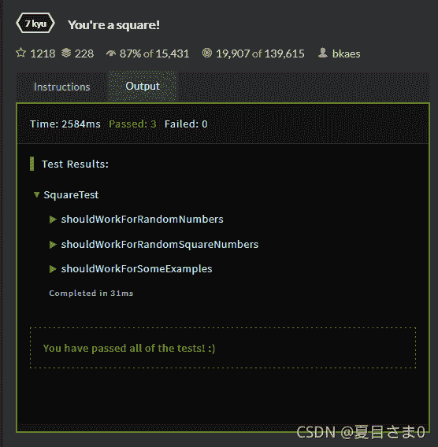

<!--yml
category: codewars
date: 2022-08-13 11:27:47
-->

# 编程游戏codewars(you‘re a square-----Java)_AntPro的博客-CSDN博客

> 来源：[https://blog.csdn.net/qq_45858986/article/details/121160683?ops_request_misc=&request_id=&biz_id=102&utm_term=codewars&utm_medium=distribute.pc_search_result.none-task-blog-2~all~sobaiduweb~default-3-121160683.142^v40^control,185^v2^control](https://blog.csdn.net/qq_45858986/article/details/121160683?ops_request_misc=&request_id=&biz_id=102&utm_term=codewars&utm_medium=distribute.pc_search_result.none-task-blog-2~all~sobaiduweb~default-3-121160683.142^v40^control,185^v2^control)

## **A square of squares**（7kyu）

[codewars](https://www.codewars.com)

You like building blocks. You especially like building blocks that are squares. And what you even like more, is to arrange them into a square of square building blocks!

However, sometimes, you can’t arrange them into a square. Instead, you end up with an ordinary rectangle! Those blasted things! If you just had a way to know, whether you’re currently working in vain… Wait! That’s it! You just have to check if your number of building blocks is a perfect square.

你喜欢积木。你特别喜欢正方形的积木。你更喜欢的是把它们排列成一个正方形的积木！

然而，有时候，你不能把它们排列成正方形。相反，你会得到一个普通的矩形！那些该死的东西！如果你只是想知道，你现在是否在徒劳地工作…等等！就这样！你只需要检查你的积木数量是否是一个完美的正方形。

Task

Given an integral number, determine if it’s a square number:
给定一个整数，确定它是一个平方数:

In mathematics, a square number or perfect square is an integer that is the square of an integer; in other words, it is the product of some integer with itself.
在数学中，一个平方数或一个平方数是整数的平方;换句话说，它是某个整数本身的乘积。

The tests will always use some integral number, so don’t worry about that in dynamic typed languages.
测试总是使用一些整数，所以不要在动态类型语言中担心这个问题。

**Examples**

```
-1  =>  false
 0  =>  true
 3  =>  false
 4  =>  true
25  =>  true
26  =>  false 
```

**Solution:**

```
public class Square {    
    public static boolean isSquare(int n) {    
      return true;
    }
} 
```

**Sample Tests:**

```
import org.junit.Test;
import static org.junit.Assert.assertEquals;
import java.util.Random;

public class SquareTest {
    @Test
    public void shouldWorkForSomeExamples() throws Exception {
      assertEquals("negative numbers aren't square numbers", false, Square.isSquare(-1));
      assertEquals("0 is a square number (0 * 0)",    true,   Square.isSquare(0));
      assertEquals("3 isn't a square number", false,  Square.isSquare(3));
      assertEquals("4 is a square number (2 * 2)",    true,   Square.isSquare(4));
      assertEquals("25 is a square number (5 * 5)",   true,   Square.isSquare(25));
      assertEquals("26 isn't a square number",false,  Square.isSquare(26));      
    }
} 
```

*这道题其实就是判断一个数 n 是不是整数的平方*

我的方法：

```
public class Square {    
    public static boolean isSquare(int n) {       
    	 int i=1;
         if(n<0)
         {
           return false;
         }
         else if(n==0)
           {
             return true;
           }
         while(i<n)
           {
             int m=i*i;
           if(m==n)
             {
               return true;
             }
           else if(m>n)
             {
               return false;
             }
           else
             {
               i=i+1;
             }
           }
         return false;
    }
} 
```

大佬的方法：

```
public class Square {    
    public static boolean isSquare(int n) {       
    	 return Math.sqrt(n) % 1 == 0;
    }
} 
```



看到大佬的方法后瞬间心肌梗塞。。。。
相关链接：[codewars 7kyu You‘re a square!](https://blog.csdn.net/qq_29549685/article/details/117398743?ops_request_misc=%257B%2522request%255Fid%2522%253A%2522163608577716780265453094%2522%252C%2522scm%2522%253A%252220140713.130102334.pc%255Fall.%2522%257D&request_id=163608577716780265453094&biz_id=0&utm_medium=distribute.pc_search_result.none-task-blog-2~all~first_rank_ecpm_v1~rank_v31_ecpm-6-117398743.pc_search_mgc_flag&utm_term=You%27re%20a%20square!&spm=1018.2226.3001.4187)