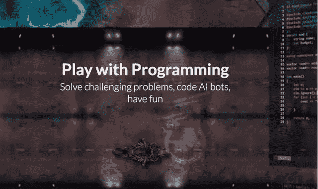
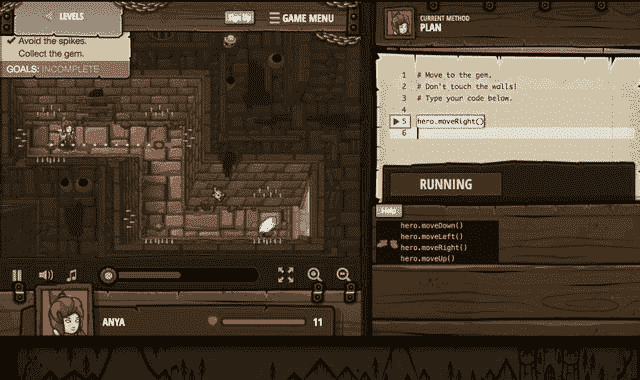
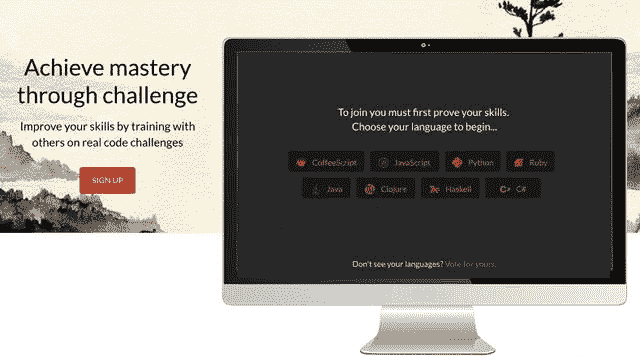

<!--yml
category: codewars
date: 2022-08-13 11:51:06
-->

# 谢绝枯燥快乐编程，四大游戏编程网站，让你边玩游戏，边学Python_醉月似心的博客-CSDN博客

> 来源：[https://blog.csdn.net/weixin_43380900/article/details/102602308?ops_request_misc=&request_id=&biz_id=102&utm_term=codewars&utm_medium=distribute.pc_search_result.none-task-blog-2~all~sobaiduweb~default-2-102602308.nonecase](https://blog.csdn.net/weixin_43380900/article/details/102602308?ops_request_misc=&request_id=&biz_id=102&utm_term=codewars&utm_medium=distribute.pc_search_result.none-task-blog-2~all~sobaiduweb~default-2-102602308.nonecase)

欢迎点击右上角关注小编，除了分享技术文章之外还有很多福利，点击：[资料](http://www.cxybcw.com/)

可以领取包括不限于Python实战演练、PDF电子文档、面试集锦、学习资料等。

# **前言**

学习编程虽然对有些人来说是件乐事,但是对大多数人来说仍然是一件比较枯燥困难的事情。当然,面临这样困惑的人,并不是只有你一个,所以,这世界上就出现了许多寓教于乐的通过游戏的形式来教你编程的网站。让你快乐学习编程

# **CodinGame**

这是一个需要编程一个 AI 机器人,然后由它来解决各种面临的问题的有趣游戏。支持各种编程语言。 支持各种编程语言。

网站: https://www.codingame.com/

# **Code CombatCodeCombat**

这是一个在真正的游戏中教学生们学习计算机编程的平台。这是一个社区项目,有上百位玩家贡献者们创建了各种关卡。支持 Java、JavaScript、Python、Lua、CoffeeScript 等语言。

网站:https://codecombat.com/play

# **Check iOCheck iO**

基于浏览器的游戏,你需要使用 Python 或 JavaScript 来解决问题才能将游戏进行下去(需要登录)。

网站:https://checkio.org/

# **Codewars**

通过挑战来精湛编程技艺。在真实的编程挑战中提升技能。支持 JavaScript、Python、C#、Java、Python 等语言。

网站: http://www.codewars.com/

# **如果你是小白用户，满足以下条件：**

会使用电脑，但从来没写过程序；

还记得初中数学学的方程式和一点点代数知识；

想从编程小白变成专业的软件架构师；

每天能抽出1~2个小时学习。

# **认识了Python编程后，没有一份的Python学习教程怎么能行**

**无偿分享最适合初学者的学习[教程](http://www.cxybcw.com/)**

本套Python课程200G从零基础开始，全面讲解Python基础，直达可以手写神经网络的境界。